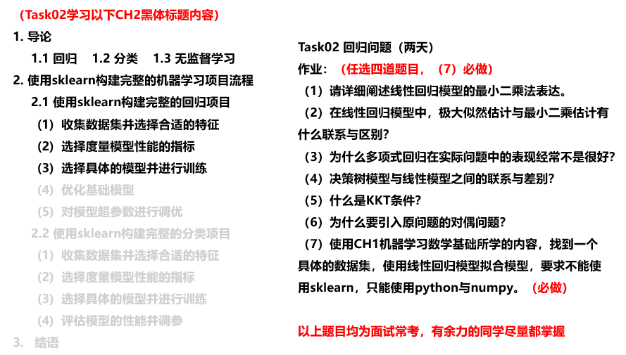

**【Task02】**

    学习内容：回归问题（2天）  
    打卡截止时间⏰：07月16日03:00 
    学习形式：视频+教案
        1.学习CH2 机器学习基础的对应内容，如图片左半部分黑体；
        2.掌握机器学习基本分类，并使用sklearn进行回归应用；
        3.完成对应的作业，如图片右半部分；
        4.整理学习笔记，输出链接在小程序中打卡。

-------

**【学习资料】**

    视频链接：https://www.bilibili.com/video/BV1Mb4y1o7ck?from=search&seid=6085778383215596866
    教案链接：https://github.com/datawhalechina/ensemble-learning
    PS: 由于CH2文档较长，大家根据图片以及视频导引，掌握对应知识点。

-------

**【学习笔记】**

一个完整的机器学习项目分为以下步骤：

    1. 明确项目任务：回归/分类  
    2. 收集数据集并选择合适的特征  
    3. 选择度量模型性能的指标  
    4. 选择具体的模型并进行训练以优化模型  
    5. 评估模型的性能并调参  

推荐书籍：

    1. 回归分析|谢宇
    2. 女士品茶