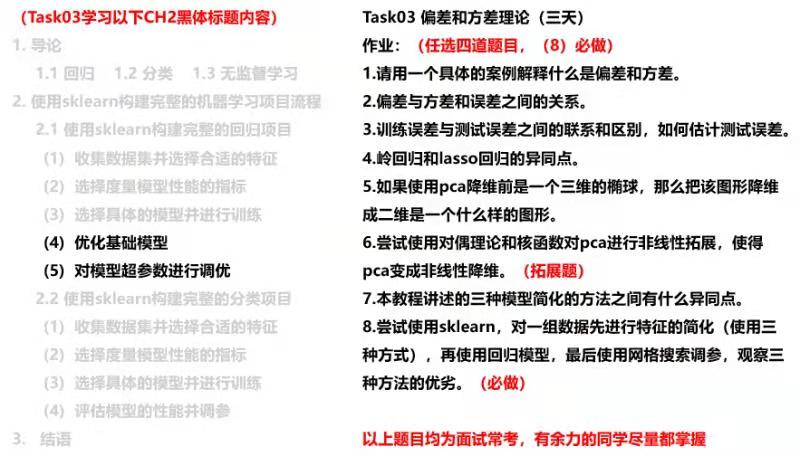

**【Task03】**

    学习内容：偏差和方差理论（3天）  
    打卡截止时间⏰：07月19日03:00 
    学习形式：视频+教案
        1. 学习CH2 机器学习基础的对应内容，如图片左半部分黑体；
        2. 掌握偏差和方差理论，并使用sklearn优化模型参数进行对比；
        3. 完成对应的作业，如图片右半部分；
        4. 整理学习笔记，输出链接在小程序中打卡。

-------

**【学习资料】**

    视频链接：https://www.bilibili.com/video/BV1Mb4y1o7ck?from=search&seid=6085778383215596866
    教案链接：https://github.com/datawhalechina/ensemble-learning
    PS: 由于CH2文档较长，大家根据图片以及视频导引，掌握对应知识点。

-------

**【学习笔记】**

$\text{Generalization Error} = \text{Variance} + \text{Bias}^2 + \text{Irreducible Error}$

How do we estimate generalization error?  
1. Indirectly: Introduce penalty term to training error
    * AIC (Akaike Information Criterion)  
    $\text{AIC} = -2logL + 2*p$

    * BIC (Bayesian Information Criterion)  
    $\text{BIC} = -2logL + log(n)*p$

    * $\text{C}_p = \frac{1}{n}(\text{RSS} + 2d\hat{\sigma}^2)$

    * $\text{Adjusted }R^2 = 1 - \frac{RSS/(n-d-1)}{TSS/(n-1)}$
2. Directly: Use test set error to estimate  
    * Cross-validation

Lasso  
* LARS 算法简介: https://cosx.org/2011/04/an-introduction-to-lars/

机器学习优化算法之贝叶斯优化: https://zhuanlan.zhihu.com/p/146329121